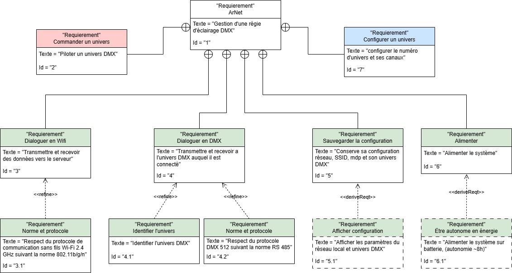
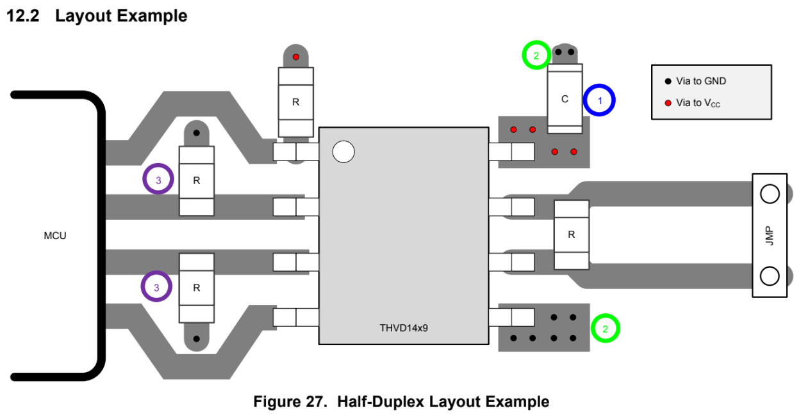

# ArtNet - Module Wi-Fi DMX

</br>

<table>
  <tr>
    <td></td>
    <!-- <td></td> -->
  </tr>
</table>

</br>

- [Synoptique](#synoptique)
- [Installation et Configuration](#installation-et-configuration)
- [Revue Technique](#revue-technique)

Le projet **ArtNet - Module Wi-Fi DMX** vise à concevoir une carte electronique permetant de commander des équipement sur un réseau DMX grace au Wi-Fi.

### Matériel utilisé

- Seeed Studio XIAO ESP32C3
- THVD1429DR
- LTV-817
- NC3MAH-LR
- LED Rouge / Verte
- Bouton

### Logiciels utilisés

- Visual Studio Code
- PlatformIO
- Proteus 8.3

## Synoptique

### Schéma d'utilisation


### Diagramme d'exigence



## Revue Technique

### Tableau comparatif des microcontroleurs

| Microcontrôleur       | Raspberry Pi Pico W | Seeed Studio XIAO ESP32-C3 | Arduino Nano RP2040 | Arduino UNO R4 WiFi |
|------------------------|--------------------|---------------------------|---------------------|--------------------|
| **Image**             |  |  |  |  |
| **Processeur**        | RP2040 (dual-core Cortex-M0+) @ 133 MHz | ESP32-C3 (RISC-V) @ 160 MHz | RP2040 (dual-core Cortex-M0+) @ 133 MHz | RA4M1 (Cortex-M4) @ 48 MHz |
| **Mémoire Flash**     | 2 Mo | 4 Mo | 16 Mo | 256 Ko |
| **RAM**              | 264 Ko | 400 Ko | 264 Ko | 32 Ko |
| **Connectivité**     | Wi-Fi (2,4 GHz), Bluetooth 5.2 | Wi-Fi (2,4 GHz), Bluetooth 5.0 | Aucune | Wi-Fi (ESP32-S3) |
| **GPIO**             | 26 | 11 | 20 | 14 |
| **Tension de fonctionnement** | 3.3V | 3.3V | 3.3V | 5V |
| **Port USB**        | USB-C | USB-C | USB-C | USB-C |
| **ADC**              | 3 canaux (12 bits) | 4 canaux (12 bits) | 3 canaux (12 bits) | 6 canaux (14 bits) |
| **DAC**              | Non | Oui (1 canal) | Non | Oui (1 canal) |
| **PWM**              | 16 canaux | 5 canaux | 16 canaux | 6 canaux |
| **UART**             | 2 | 2 | 2 | 1 |
| **SPI**              | 2 | 1 | 2 | 1 |
| **I2C**              | 2 | 1 | 2 | 1 |
| **Consommation**     | Faible | Très faible | Faible | Moyenne |
| **Prix Approx.**     | ~6-8€ | ~6-10€ | ~10-12€ | ~20-25€ |

### Choix du microcontroleur

kkk

### Configuration de PlatformeIO

Fichier `platformio.ini` pour Seeed XIAO ESP32C3

```ini
; selectioner l'environement voulue
[platformio]
default_envs = seeed_xiao_esp32c3

[common]
monitor_speed = 115200
lib_deps_external = 
	someweisguy/esp_dmx@^4.1.0
	knolleary/PubSubClient@^2.8
	bblanchon/ArduinoJson@^7.3.1
	esp32async/ESPAsyncWebServer@^3.7.4
	esp32async/AsyncTCP @ ^3.3.8
	adafruit/Adafruit SSD1306

[env:seeed_xiao_esp32c3]
platform = espressif32
board = seeed_xiao_esp32c3
board_build.mcu = esp32c3
board_build.f_cpu = 160000000L
framework = arduino 
monitor_speed = ${common.monitor_speed}
lib_deps = 
	${common.lib_deps_external}

[env:esp32dev]
platform = espressif32
board = esp32dev
framework = arduino
monitor_speed = ${common.monitor_speed}
lib_deps = 
	${common.lib_deps_external}
```

### Brochage des Pins


[Voir le Wiki seed studio](https://wiki.seeedstudio.com/XIAO_ESP32C3_Getting_Started/)

### Affectation des Entreés/Sorties

Voici un tableau des broches utilisées, leur configuration, et les composants associés.

| **Broches** | **Fonction**  | **Désignation**        | **Composants / Structure**       | **Configuration** |
|-------------|---------------|------------------------|-----------------------------------|--------------------------------------------|
| IO4         |               | SW1                   | Sélecteur de tête                | Entrée + pull-up interne                   |

### Tableau de consomation

| Composant    | Consommation (mA) | Nombre | Consommation totale (mA) |
|--------------|-------------------|--------|--------------------------|
| ESP32 C3     | 74                | 1      | 74                       |
| LTV-817      | 20                | 3      | 60                       |
| THVD1429DR   | 60                | 1      | 60                       |
| LED XLR      | 20                | 2      | 40                       |
|              |                   |        |                          |
| **Totale (A)** |                   |        | **234 mA**                 |

---

### Interface DMX-512 (RS-485)

#### 🔹 Niveaux de tension recommandés pour le DMX-512 (RS-485)

- **DMX-512 utilise un signal différentiel (RS-485)** entre **DATA+ (A)** et **DATA- (B)**.
- **Seuil minimum** : ±200 mV pour un signal valide.
- **État logique défini** :
  - **"1" (Mark) = DATA+ > DATA-**
  - **"0" (Space) = DATA+ < DATA-**
  - **Bus au repos ≈ 2.5V sur A et B (failsafe = logique "1")**.

<br>


<br>

> [!IMPORTANT]  
> 🔧 Bonnes pratiques pour une interface DMX-512 fiable
>
> ✔ **Alimentation en 5V** pour respecter les normes DMX.  
> ✔ **Utiliser un câblage torsadé** (ex. **Belden 9842**).  
> ✔ **Ajouter des résistances de terminaison 120 Ω** aux extrémités.  
> ✔ **Limiter le nombre de périphériques** (32 standard, 256 avec transceivers 1/8 UL).  

#### 🔍 Comparaison rapide des transceivers RS-485  

| Caractéristique      | SN65LBC184          | THVD1429DR        | MAX485           |
|----------------------|--------------------|--------------------|------------------|
| **Alimentation (Vcc)** | 4.75V - 5.25V | 3V - 5.5V | 4.75V - 5.25V |
| **Vitesse max** | 2.5 Mbps | **20 Mbps** | 2.5 Mbps |
| **Conso en veille** | 1.3 mA | **2 µA** | 120 µA |
| **Protection ESD** | ±12 kV | **±16 kV** | ±15 kV |
| **Failsafe intégré** | ✅ Oui | ✅ Oui | ❌ Non |
| **Charge Unitaire (UL)** | **1/8 UL** | **1/8 UL** | 1/4 UL |
| **Température max** | 85°C | **125°C** | 70°C |

#### Protection contre les decharges electrostatique


#### Isolation galvanique entre le Microcontroleur et l'interface RS-485


Calcule de la valeur de résistance pour les optocoupleurs

- Avec VCC = 5V

  $R = \frac{VCC - Vf}{If} = \frac{5 - 1.2}{20 \times 10^{-3}} = 190 \Omega$  
  R : E12, $180\Omega$ , ±10%, ¼W, à film métallique

- Avec VCC = 3.3V  

  $R = \frac{VCC - Vf}{If} = \frac{3.3 - 1.2}{20 \times 10^{-3}} = 105 \Omega$  
  R : E12, $100\Omega$ , ±10%, ¼W, à film métallique

- Résistance de tirage

  R : E12, $10k\Omega$ , ±10%, ¼W, à film métallique

#### Exemple d'implementation des composants



#### Validation de la communication en DMX 512 avec un projecteur par 56

Pour commander le projecteur par 56, nous avons utiliser un shield entre l'ESP32 et le projecteur.


pour la partie programmation, la librairie "esp_dmx" a été utiliser.

un code permetant de changer la couleur du spot de rouge a vert puis bleu.

``` cpp

```

---

### Schéma structurel


[Voir le schéma structurel]([documentation/Schéma%20structurel%20Magic%20Air.pdf](https://drive.google.com/file/d/14fQQeiAX1P91fE9i7GWyYnOiAEXLKIbo/view?usp=drive_link))

### Nomenclature (BOM)


[Voir la nomenclature](documentation/Nomenclature%20Magic%20Air.pdf)

### Devis


[Voir le devis]([documentation/Devis%20Magic%20Air.pdf](https://drive.google.com/file/d/12X9w5mhPE3-XjVhsdZISE62wrRXizDG-/view?usp=drive_link))

### Liste des composants principaux

| **Nom du Composant**  | **Description**                                   |
|-----------------------|---------------------------------------------------|
| [LED Rouge](documentation/datasheet/Led%20rouge.pdf)  | Indication de la qualité de l'air                   |
| [LED Bleu](documentation/datasheet/Led%20bleu.pdf)    | Indication de la qualité de l'air                   |
| [DHT22](documentation/datasheet/DHT22.pdf)            | Capteur de température et d'humidité               |
| [SGP40](documentation/datasheet/SGP40.pdf)            | Capteur de qualité de l'air                        |
| [OLED 128x64](documentation/datasheet/Oled%20128-64.pdf) | Afficheur OLED I2C (128x64 pixels)                |
| [l7805](documentation/datasheet/l7805.pdf) | Régulateur de tension 5V 1A   |

&copy; 2025 La Salle Avignon - ArtNet - MARTIN Mathis
