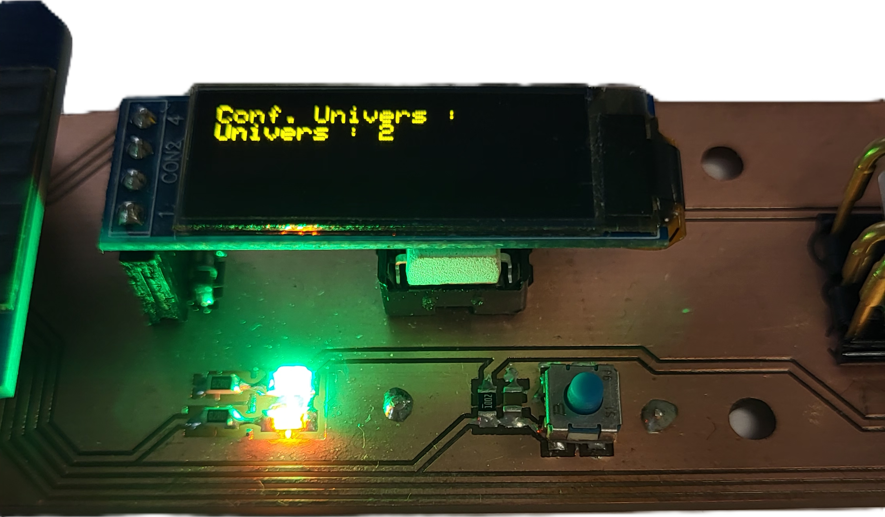

<a href="https://github.com/bts-lasalle-avignon-projets/plug-in-pool-2025">
	
</a>
<a href="https://github.com/bts-lasalle-avignon-projets/plug-in-pool-2025/releases">
	
</a>

# ArtNet - Module Wi-Fi DMX

</br>

<table>
  <tr>
    <td></td>
    <td></td>
  </tr>
</table>

</br>

- [Le projet](#le_projet)
  - [Logiciels utilisés](#logiciels_utilisés)
- [Installation et Configuration](#installation-et-configuration)
  - [Prérequis](#Prérequis)
  - [Alimentation](#Alimentation)
  - [Temoins Lumineux](#Temoins_Lumineux)
  - [Affichage de la configuration](#Affichage_de_la_configuration)
    - [Menu de configuration Wi-Fi](#Menu_de_configuration_Wi-Fi)
    - [Menu de configuration MQTT](#Menu_de_configuration_MQTT)
    - [Menu de configuration Univer](#Menu_de_configuration_Univer)
  - [Réinitialisation](#Réinitialisation)
  - [Premiére mise en service](#Premiére_mise_en_service)
  - [Configuration de PlatformIO](#Configuration_de_PlatformIO)

# Le projet

Le système développé dans le cadre de ce projet a pour objectif d’assurer la
supervision et le pilotage automatisé des éclairages scéniques en s’appuyant
sur le protocole DMX-512. Il permet de centraliser le contrôle de divers
équipements lumineux.

Grâce à une interface logicielle, l’utilisateur peut gérer les jeux de lumière de
manière dynamique, sans recourir à une console DMX traditionnelle.
Ce système vise à offrir une solution flexible, évolutive et accessible, adaptée
aussi bien aux DJs qu’aux animateurs souhaitant automatiser et personnaliser leurs
ambiances lumineuses depuis une tablette.

L’objectif du projet est de développer un système de contrôle d’éclairage,
reposant sur des **modules WiFi-DMX**, afin de piloter différentes zones scéniques
de façon centralisée, tout en conservant une gestion indépendante pour chaque
zone, via une interface numérique (la régie).

### Logiciels utilisés

- Visual Studio Code
- PlatformIO
- Proteus 8.3

## Installation et Configuration

### Prérequis

Avant d'utiliser votre module Wi-Fi DMX il vous faudra configuré la régie d'éclairage : https://github.com/bts-lasalle-avignon-projets/artnet-2025

### Alimentation

Utiliser un cable USB-C avec au minimum 500 mA.

### Temoins Lumineux



- **LED Verte** : temoins de présence de tension 5V et 3.3V.
- **LED Orange** : temoins d'etat de la carte. Tant que la carte n'est pas connecter au Wi-Fi ou le serveur MQTT, alors elle clignote.


- **LED Rouge** : S'allume aprés l'initialisation du bus DMX.
- **LED Verte** : Clignote a chaque nouvelle envoie sur la liaison DMX.

### Affichage de la configuration

Pour l'affichage, un ecran avec trois menu change toutes les 10s.

#### Menu de configuration Wi-Fi


| Menu | Élément                | Exemple de valeur         |
|-----------|------------------------|----------------------------|
| Wi-Fi     | SSID                   | "MonWiFi"                   |
| Wi-Fi     | Adresse IP du module WI-Fi DMX                   | 192.168.1.102                   |
| Wi-Fi     | Qualité du signal Wi-Fi                   | Assez bon                   |

#### Menu de configuration MQTT


| Menu | Élément                | Exemple de valeur         |
|-----------|------------------------|----------------------------|
| MQTT     | Nom du module Wi-Fi DMX             | "Artnet-0AB4"                   |
| MQTT     | Adresse IP du serveur MQTT (broker)                  | 192.168.1.104                   |

#### Menu de configuration Univer


| Menu | Élément                | Exemple de valeur         |
|-----------|------------------------|----------------------------|
| Univer     | Univers du module Wi-Fi DMX | 2 |

### Réinitialisation


Pour réinitialiser au paramettre d'usine, il faut appuyer sur le bouton présent sur la carte.

### Premiére mise en service

Lors du démarage si il n'y a pas de valeur de configuré alors, le module se met en mode point d'acces Wi-Fi.


1. Connecter vous au Wi-Fi du module :


2. Entrée l'adresse IP du module Wi-Fi DMX renseigner sur l'écran dans votre navigateur.

3. Renseigné les valeurs de votre configuration : Wi-Fi, MQTT et numéro d'univer


4. Aprés avoir renseigner les valeurs de la configuration, appuyer sur Connexion. Le module Wi-Fi DMX va alors redémarré.

5. En cas de réussite de connexion, l'écran doit afficher les valeurs configuré.

### Configuration de PlatformIO

Fichier `platformio.ini` pour le module Wi-Fi DMX.

```ini
[platformio]
default_envs = esp32dev

[common]
monitor_speed = 115200
lib_deps_external = 
	someweisguy/esp_dmx@^4.1.0
	knolleary/PubSubClient@^2.8
	bblanchon/ArduinoJson@^7.3.1
	esp32async/ESPAsyncWebServer@^3.7.4
	esp32async/AsyncTCP @ ^3.3.8
	adafruit/Adafruit SSD1306

[env:esp32dev]
platform = espressif32
board = esp32dev
framework = arduino
monitor_speed = ${common.monitor_speed}
lib_deps = 
	${common.lib_deps_external}
```

&copy; 2025 La Salle Avignon - ArtNet - MARTIN Mathis
